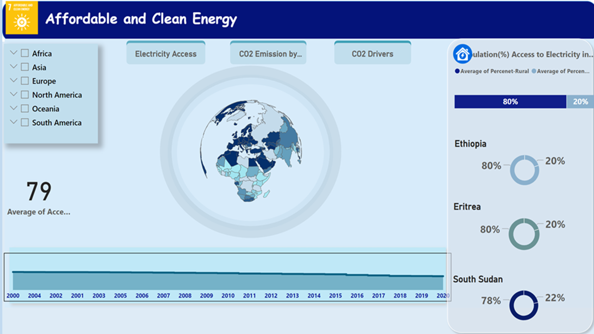
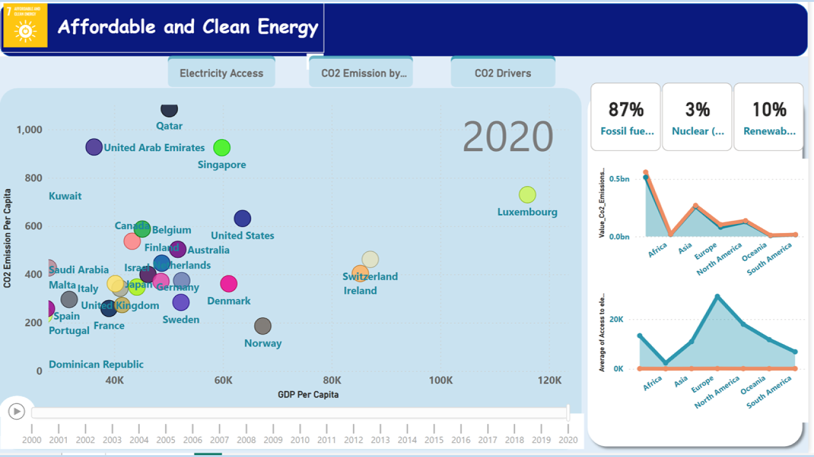
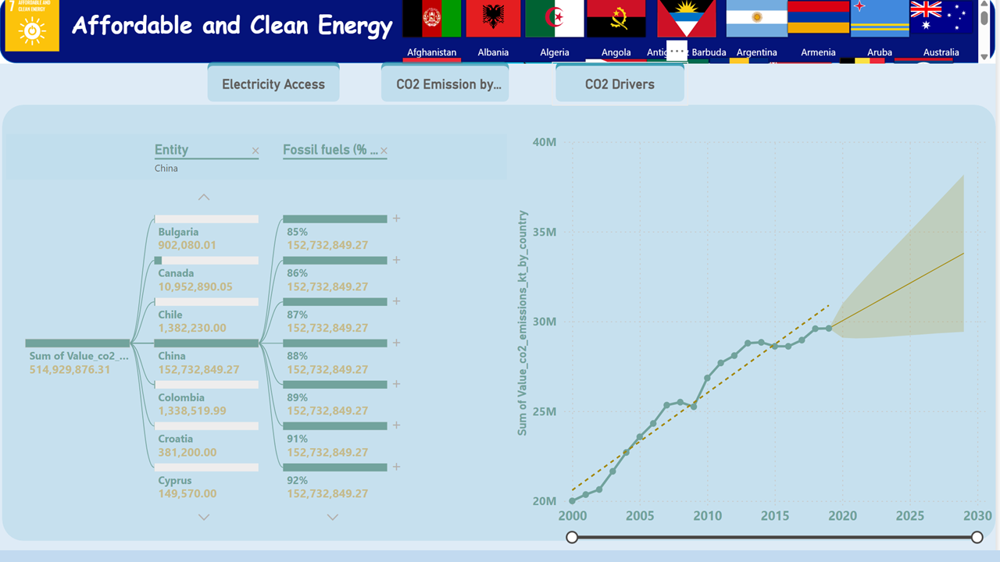

# SDG_7 Analysis

Table of Contents
- [Background](#background)
- [Problem Statement](#problem-statement)
- [Skills Demonstrated](#skills-demonstrated)
- [Scope](#scope)
- [Methodology](#methodology)
- [Expected Outcome](#expected-outcome)
- [Analysis Highlight](#analysis-highlight)
- [Conclusion](#conclusion)
- [Data Source](#data-source)
## Background
Sustainable Development Goal 7  is one of 17 Sustainable Development Goals established by the United Nations General Assembly in 2015. It aims to "Ensure access to affordable, reliable, sustainable and modern energy for all. "Access to energy is an important pillar for the wellbeing of the people as well as for economic development and poverty alleviation. The number of people using dirty fuels is still increasing due to population growth and slow progress in rolling out renewable energy. Global energy demand is expected to increase by 50% over the next 30 years as a result of population growth and economic development. High-income countries must lead the way in transitioning to clean fuels and support low-income countries to do the same. Ending population growth will make a global switch to affordable and clean energy a lot more achievable.
## Problem Statement 
Increasing access to affordable and clean energy sources is essential for sustainable development. However, challenges persist in understanding energy consumption patterns, identifying areas with limited access to clean energy, and assessing the effectiveness of energy interventions. This project aims to utilize Power BI to analyze energy consumption data, identify disparities in energy access, and evaluate the impact of clean energy initiatives. The analysis aims to:
- Collect, clean and integrate relevant data sources from Kaggle Dataset to quantify access to electricity on urban and rural and CO2 emissions associated with energy use  for each country.
- Visualize and compare the energy use and CO2 emissions across different energy use  between countries.
- Identify key drivers of CO2 emissions in the primary energy consumption for each country
- Provide actionable insights that support evidence-based decision-making by policymakers, energy providers, and other stakeholders, ultimately contributing to the achievement of SDG 7 targets
## Skills Demonstrated
The following Power Bi features were incorporated
- Filter,
- DAX,
- Modeling,
- Bookmarks
- Buttons
- Tooltips
## Scope
The analysis will cover a wide range of countries representing diverse geographical regions, levels of development, and primary energy consumption It will include data on CO2 emissions from energy use.
## Methodology
The analysis will involve several steps:
- Data Collection: Gathering relevant data sources on primary energy consumption , and its emissions inventories from reputable sources Kaggle dataset. 
- Data Integration: Combining and cleansing the data for consistency and compatibility using Power BI's data modelling capabilities.
- Analysis and Visualization: Creating interactive visualizations, including maps, charts, decomposition tree, line chart including forecast and donut chart, to explore the energy use and its CO2 emissions trends, patterns, and relationships.
- Dashboard Development: Designing user-friendly dashboards in Power BI to present the findings, allowing users to filter, navigate the page using buttons  into specific countries, sectors, and variables.
- Interpretation and Reporting: Interpreting the results, identifying insights, and documenting the analysis process and findings in a comprehensive report.
## Expected Outcome
The analysis will deliver an interactive Power BI dashboard providing stakeholders with valuable insights into primary energy consumption and its CO2 emissions by country and emission drivers. 
The visualization tool will enable users to identify the top emitters , assess the effectiveness of current policies, and explore potential intervention strategies for renewable energy access and utilization  to reduce emissions while providing affordable and clean energy in a sustainable manner . 
## Analysis Highlight
### Summary of Access to Electricity

SDG 7 aims to ensure access to affordable, reliable, and sustainable energy for all. On average, 85 percent of people across the world had access to electricity in 2020—but in some countries the access rate was as low as 19 percent. Increased electricity access, however, has come with higher greenhouse emissions. There is a stark divide in global access to electricity between urban and rural areas. In 2020,713 million people worldwide lacked access to electricity. Around 80 percent of those lived in rural areas. 
### CO2 Emission By GDP

In the past, progress in access to electricity has driven up greenhouse gas emissions. The rapid expansion of access to electricity in South Asia, for example, has fueled an increase in emissions from the electricity and heat sector. This is because much of this expansion was driven by electricity generated from fossil fuels (coal, natural gas, oil). 
### CO2 Emission Drivers

- Between 2000 and 2020, the worldwide proportion of population with access to electricity rose from 78 to 90 percent. Over the same period, greenhouse gas emissions from the electricity and heat sector rose from 1.7 to 1.9 tons per capita.
- East Asia & Pacific and Middle East & North Africa are approaching full access to electricity, but at the same time they are increasing their greenhouse gas emissions per capita. Latin America is also evolving towards universal access to electricity, but with significantly lower emissions per capita due to its higher reliance on hydropower compared to other regions.
- North America and Europe & Central Asia have already achieved full access to electricity and have the highest emissions per capita, although these are declining.
- South Asia has made progress increasing access to electricity. Emissions per capita have also increased, but remain at a low level compared to other regions.
- Sub-Saharan Africa has the lowest greenhouse gas emissions per capita. However, while all other regions have reached near universal electricity access, Sub-Saharan Africa remains far from achieving this goal.
## Conclusion:
Under SDG 7, countries face the often conflicting challenge of bringing electricity to all, SDG target 7.1, and at the same time increasing the proportion generated using renewable sources to reduce greenhouse gas emissions, SDG target 7.2. Both targets must be addressed simultaneously by 2030. 
Progress towards achieving universal access to electricity (SDG indicator 7.1.1) has been slow over the last 20 years. 
The share of the global population with access to electricity increased from 78 percent in 2000 to 85 percent in 2020. 
Based on current trends, this figure is expected to rise only marginally from 85 percent in 2020 to 92 percent by 2030.
South Asia drove most of the gains in the last two decades, rising from 58 percent in 2000 to 97 percent in 2020. 
Africa has also made progress, with electricity access rising from an average 57 percent in 2000 to 71 percent in 2020. 
One out of two people in Sub-Saharan Africa lacked access to electricity in 2020, and access in this region would need to more than double by 2030 to meet SDG target 7.1. 
There is a stark divide in global access to electricity between urban and rural areas. In 2020,713 million people worldwide lacked access to electricity. Around 80 percent of those lived in rural areas. 

You can interact with the [here](https://app.powerbi.com/groups/me/reports/ce7fa8d5-10bb-47a8-bb20-7c0e1005660a/ReportSection6fa01870805eb0430373?experience=power-bi&bookmarkGuid=Bookmark2c88306b64c6db2a0130)

## Data Source
The primary dataset used for this analysis is Kaggle dataset

